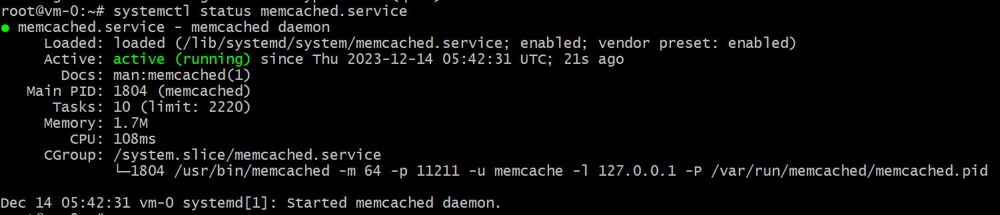
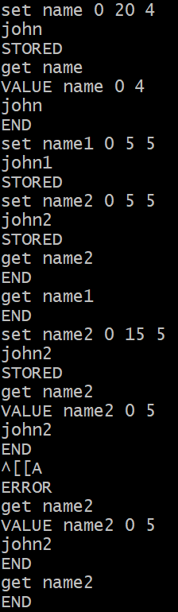

# Домашнее задание к занятию «Кеширование Redis/memcached»

---

### Задание 1. Кеширование 

Приведите примеры проблем, которые может решить кеширование. 

*Приведите ответ в свободной форме.*

#### Овет 

* Например, сократить время ответа от БД на запрос, т.е. если при запросе к БД БД нужно выполнять множество расчетов при извлечении данных для отработки запроса, т.к. само извлечение данных из БД и "склеивание" и т.п. может занимать много времени. Можно прежде чем посылать запрос к БД проверить есть ли уже свежий кэш в сервисе кеширования и быстро отдать уже готовые данные.
Кэш можно подготовить - разогреть кэш.
* минимизировтаь нагрузку на БД или на рабочие системы, например, если есть сервер с веб сайтами, и идут одинаковые запросы, то, можно взять данные из кэша и не нагружать сайты (сереры).

---

### Задание 2. Memcached

Установите и запустите memcached.

*Приведите скриншот systemctl status memcached, где будет видно, что memcached запущен.*

---

### Задание 3. Удаление по TTL в Memcached

Запишите в memcached несколько ключей с любыми именами и значениями, для которых выставлен TTL 5. 

*Приведите скриншот, на котором видно, что спустя 5 секунд ключи удалились из базы.*

- записал с ключами name, name1, name2  и проверил что по истеченю ttl данные удаляются.

---

### Задание 4. Запись данных в Redis

Запишите в Redis несколько ключей с любыми именами и значениями. 

*Через redis-cli достаньте все записанные ключи и значения из базы, приведите скриншот этой операции.*

## Дополнительные задания (со звёздочкой*)
Эти задания дополнительные, то есть не обязательные к выполнению, и никак не повлияют на получение вами зачёта по этому домашнему заданию. Вы можете их выполнить, если хотите глубже разобраться в материале.

### Задание 5*. Работа с числами 

Запишите в Redis ключ key5 со значением типа "int" равным числу 5. Увеличьте его на 5, чтобы в итоге в значении лежало число 10.  

*Приведите скриншот, где будут проделаны все операции и будет видно, что значение key5 стало равно 10.*
